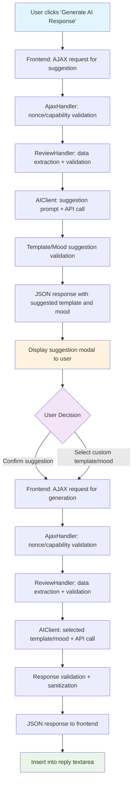

# Data Flow

This document describes the complete data flow for AI response generation in the WooCommerce AI Review Responder plugin.

## Visual Flow Diagram



## Step 1: Template and Mood Suggestion

```
Frontend (admin.js)
    ↓ AJAX request for suggestion
AjaxHandler (nonce/capability validation)
    ↓
ReviewHandler (data extraction + validation)
    ↓
AIClient (suggestion prompt + API call)
    ↓
Template/Mood suggestion validation
    ↓
JSON response with suggested template and mood
    ↓
Display suggestion modal to user
```

## Step 2: AI Response Generation

```
User confirms suggestion OR selects custom template/mood
    ↓
Frontend (admin.js)
    ↓ AJAX request for generation
AjaxHandler (nonce/capability validation)
    ↓
ReviewHandler (data extraction + validation)
    ↓
AIClient (selected template/mood + API call)
    ↓
Response validation + sanitization
    ↓
JSON response to frontend
    ↓
Insert into reply textarea
```

## Key Components

### Frontend (TypeScript/JavaScript)
- **Location**: `src/admin-review-listeners.ts`
- **Responsibility**: User interaction handling, AJAX requests, UI updates
- **Key Functions**: 
  - Event listeners for "Generate AI Response" button
  - Modal management for template/mood selection
  - Response insertion into textarea

### AjaxHandler (PHP)
- **Location**: `includes/Endpoints/AjaxHandler.php`
- **Responsibility**: Request validation, security checks, response formatting
- **Key Functions**:
  - Nonce verification
  - Capability checks (`moderate_comments`)
  - JSON response formatting

### ReviewHandler (PHP)
- **Location**: `includes/Admin/ReviewActions.php`
- **Responsibility**: Review data extraction, validation, AI client coordination
- **Key Functions**:
  - Review data extraction from WordPress database
  - Input validation and sanitization
  - AI client method calls

### AIClient (PHP)
- **Location**: `includes/Clients/GeminiClient.php`
- **Responsibility**: AI API communication, prompt building, response processing
- **Key Functions**:
  - Template and mood suggestion generation
  - AI response generation with selected parameters
  - API error handling and rate limiting

## Security Flow

1. **Frontend Security**: All AJAX requests include WordPress nonces
2. **Backend Security**: Capability checks ensure only authorized users can generate responses
3. **Input Validation**: All user inputs are sanitized and validated
4. **Output Escaping**: All responses are properly escaped before display
5. **API Security**: API keys are stored securely in environment variables

## Error Handling Flow

1. **Frontend Errors**: Displayed in modal with user-friendly messages
2. **Backend Errors**: Logged for debugging, generic messages sent to frontend
3. **API Errors**: Graceful fallback to template-based responses
4. **Validation Errors**: Specific error messages for missing or invalid data

## Performance Considerations

- **Caching**: API responses cached for 24 hours using WordPress transients
- **Rate Limiting**: Built-in rate limiting to prevent API abuse
- **Async Processing**: Non-blocking AJAX requests for better user experience
- **Optimized Queries**: Efficient database queries for review data extraction
